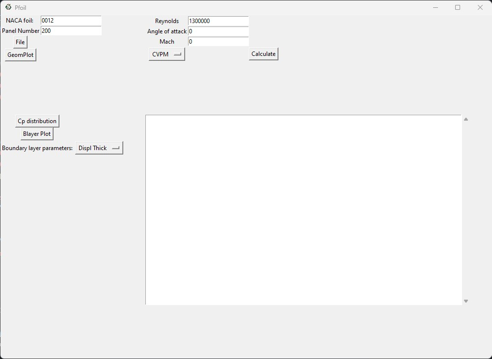

# Pfoil

This program was created as part of the final thesis for the bachelor's degree in Aerospace Engineering at the Universidad de León. The main objective was to gain a deeper understanding of transpiration methods and use them as a tool in the thesis. The information needed to develop this project was sourced from the 'Fundamentals of Aerodynamics' by author Mark Drela, the XFOIL documentation, and the MFOIL code from Professor Krzysztof J. Fidkowski at the University of Michigan, Ann Arbor.

The main objective was not to substitute XFOIL; therefore, it is not as fast or accurate as that code. However, the Python programming language offers a more modern approach to this well-known software, providing the author with the opportunity to enhance their programming skills at a higher level. Once again, Professor Krzysztof J. Fidkowski's MFOIL was of great assistance, especially in the viscous part, where some functions were taken from that code and implemented in Python. This allowed the program to work seamlessly as a complete application with its own GUI.

The code can be used under the MIT license. As mentioned earlier, the programming skills are more beginner-level than that of an experienced programmer, so there is a possibility that certain parts of the code could be updated and optimized. If I find the time, I plan to implement additional features and release them as new versions of the program.

